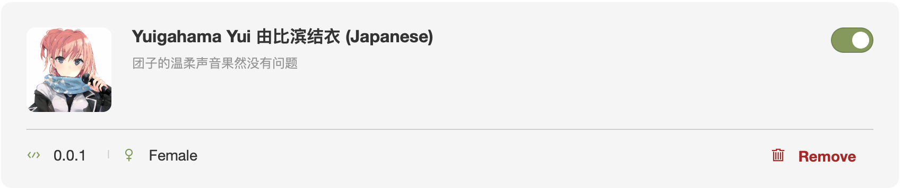
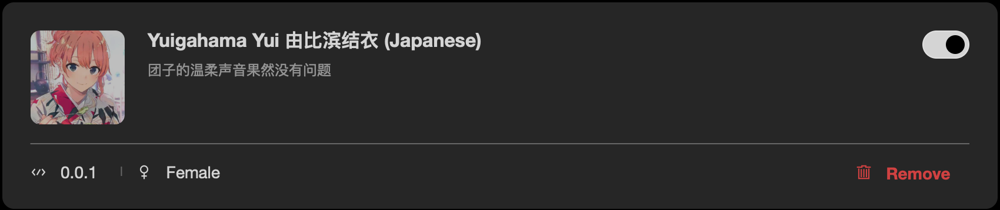

# Yuigahama Yui rainbow-fart 语音包

> 由比滨结衣是个温柔的女孩，我如此擅自地贴上了标签。
>                                  —— 大老师

团子语音包，衍生于 VSCode 彩虹屁🌈插件 [vscode-rainbow-fart](https://github.com/SaekiRaku/vscode-rainbow-fart) 的扩展包。

春物第三季就要播出了，赶快抱紧团子跑路（逃

## preview

## install

导入本语音包请参考 `vscode-rainbow-fart` 的 [官方教程](https://saekiraku.github.io/vscode-rainbow-fart/#/zh/README.md).

本项目已经打包好了相关zip文件，可以直接在 [Releases](https://github.com/syang-ng/Yuigahama-Yui-rainbow-fart/releases) 中下载最新版 zip.

在本地 vscode 启动的 rainbow-fart 配置页面中 Settings -> Voice Packages -> Import 中导入 zip，导入后 enable 开启使用.

## Others

很惭愧关于团子的语音素材不多，希望团子厨们多提 issue / pull request 来丰富素材。最后献上一首 [Hello Alone -Yui Ballade-](./preview/Hello%20Alone%20(Yui%20Ballade).mp3) 给大家